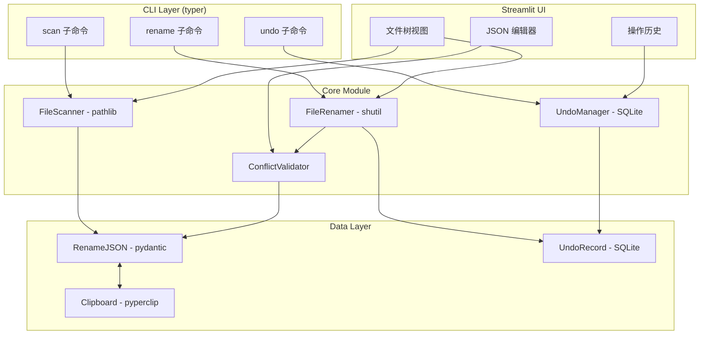

# Design Document

## Overview

trename 是一个文件批量重命名工具，采用 JSON 作为中间格式，支持与 AI 翻译服务协作完成文件名翻译和重命名。系统由 CLI 核心模块和 Streamlit Web 界面组成，提供完整的扫描、编辑、重命名和撤销功能。

### 核心工作流程


## Architecture



### 依赖库选择

| 功能 | 库 | 说明 |
|-----|-----|-----|
| CLI 框架 | **typer** | 现代 Python CLI 框架，自动生成帮助文档 |
| 数据验证 | **pydantic** | JSON Schema 验证和序列化 |
| 剪贴板 | **pyperclip** | 跨平台剪贴板操作 |
| 文件操作 | **pathlib + shutil** | Python 标准库，稳定可靠 |
| 撤销存储 | **SQLite** | 轻量级数据库，持久化撤销记录 |
| Web UI | **streamlit** | 快速构建数据应用界面 |
| 属性测试 | **hypothesis** | Python PBT 库 |

## Components and Interfaces

### 1. FileScanner

负责扫描目录并生成 Rename_JSON 结构。使用 `pathlib` 进行文件系统遍历。

```python
from pathlib import Path

class FileScanner:
    def scan(self, root_path: Path) -> RenameNode:
        """使用 pathlib.iterdir() 递归扫描目录"""
        pass
    
    def to_json(self, node: RenameNode) -> str:
        """使用 pydantic 的 model_dump_json() 序列化"""
        pass
```

### 2. FileRenamer

执行实际的文件重命名操作。使用 `shutil.move()` 进行安全的文件移动。

```python
import shutil
from pathlib import Path

class FileRenamer:
    def __init__(self, undo_manager: UndoManager):
        self.undo_manager = undo_manager
    
    def rename_batch(self, root: RenameNode, base_path: Path) -> RenameResult:
        """批量重命名，使用 shutil.move() 执行"""
        pass
    
    def _rename_single(self, src: Path, tgt: Path) -> bool:
        """使用 shutil.move(src, tgt) 重命名"""
        pass
```

### 3. ConflictValidator

检测重命名冲突。

```python
class ConflictValidator:
    def validate(self, root: RenameNode, base_path: Path) -> list[Conflict]:
        """检测所有冲突，返回冲突列表"""
        pass
    
    def check_target_exists(self, src: Path, tgt: Path) -> bool:
        """检查目标路径是否已存在"""
        pass
    
    def check_duplicate_targets(self, nodes: list[RenameNode]) -> list[Conflict]:
        """检查是否有多个源映射到同一目标"""
        pass
```

### 4. UndoManager

管理撤销记录和执行撤销操作。使用 SQLite 持久化存储撤销历史。

```python
import sqlite3
from pathlib import Path

class UndoManager:
    def __init__(self, db_path: Path = Path.home() / ".trename" / "undo.db"):
        """初始化 SQLite 数据库连接"""
        self.conn = sqlite3.connect(db_path)
        self._init_tables()
    
    def _init_tables(self):
        """创建 undo_batches 和 undo_operations 表"""
        pass
    
    def record(self, operations: list[RenameOperation]) -> str:
        """将操作记录插入数据库，返回 batch_id"""
        pass
    
    def undo(self, batch_id: str) -> UndoResult:
        """从数据库读取记录并执行撤销"""
        pass
    
    def get_history(self, limit: int = 10) -> list[UndoRecord]:
        """查询最近的操作历史"""
        pass
```

### 5. ClipboardHandler

处理剪贴板读写。使用 `pyperclip` 库实现跨平台支持。

```python
import pyperclip

class ClipboardHandler:
    def copy(self, text: str) -> None:
        """使用 pyperclip.copy() 复制到剪贴板"""
        pyperclip.copy(text)
    
    def paste(self) -> str:
        """使用 pyperclip.paste() 从剪贴板读取"""
        return pyperclip.paste()
```

### 6. JSONParser

解析和序列化 Rename_JSON。使用 `pydantic` 进行数据验证和序列化。

```python
from pydantic import BaseModel, ValidationError

class JSONParser:
    def parse(self, json_str: str) -> RenameNode:
        """使用 pydantic model_validate_json() 解析并验证"""
        return RenameJSON.model_validate_json(json_str)
    
    def serialize(self, node: RenameNode) -> str:
        """使用 pydantic model_dump_json(indent=2) 序列化"""
        return node.model_dump_json(indent=2)
    
    def validate_schema(self, json_str: str) -> list[str]:
        """使用 pydantic 验证，捕获 ValidationError"""
        try:
            RenameJSON.model_validate_json(json_str)
            return []
        except ValidationError as e:
            return [str(err) for err in e.errors()]
```

## Data Models

### RenameNode

表示文件树中的一个节点（文件或目录）。使用 `pydantic.BaseModel` 实现自动验证和序列化。

```python
from pydantic import BaseModel, computed_field

class FileNode(BaseModel):
    """文件节点"""
    src: str                    # 源文件名
    tgt: str = ""               # 目标文件名（空字符串表示待翻译）
    
    @computed_field
    @property
    def is_pending(self) -> bool:
        return self.tgt == ""

class DirNode(BaseModel):
    """目录节点"""
    src_dir: str                # 源目录名
    tgt_dir: str = ""           # 目标目录名
    children: list["FileNode | DirNode"] = []
    
    @computed_field
    @property
    def is_pending(self) -> bool:
        return self.tgt_dir == ""

class RenameJSON(BaseModel):
    """根节点"""
    root: list[FileNode | DirNode]
```

### RenameJSON Schema

```json
{
  "root": [
    {
      "src_dir": "项目",
      "tgt_dir": "",
      "children": [
        {"src": "合同.pdf", "tgt": ""},
        {"src": "发票.xlsx", "tgt": ""},
        {
          "src_dir": "子文件夹",
          "tgt_dir": "",
          "children": [
            {"src": "说明.docx", "tgt": ""}
          ]
        }
      ]
    }
  ]
}
```

### Conflict

表示一个重命名冲突。

```python
@dataclass
class Conflict:
    type: ConflictType  # TARGET_EXISTS | DUPLICATE_TARGET
    src_path: Path
    tgt_path: Path
    message: str
```

### UndoRecord

表示一次可撤销的操作记录。

```python
@dataclass
class UndoRecord:
    id: str
    timestamp: datetime
    operations: list[RenameOperation]
    
@dataclass
class RenameOperation:
    original_path: Path
    new_path: Path
```

### RenameResult

表示批量重命名的结果。

```python
@dataclass
class RenameResult:
    success_count: int
    failed_count: int
    skipped_count: int
    conflicts: list[Conflict]
    operation_id: str  # 用于撤销
```


## Correctness Properties

*A property is a characteristic or behavior that should hold true across all valid executions of a system-essentially, a formal statement about what the system should do. Properties serve as the bridge between human-readable specifications and machine-verifiable correctness guarantees.*

### Property 1: Scan Completeness and Structure Preservation

*For any* directory tree, scanning it SHALL produce a Rename_JSON that contains all files and subdirectories while preserving the exact hierarchical structure.

**Validates: Requirements 1.1, 1.4**

### Property 2: Rename Execution Correctness

*For any* valid Rename_JSON where src and tgt are both non-empty and no conflicts exist, executing rename SHALL result in all source files being renamed to their target names.

**Validates: Requirements 2.3**

### Property 3: Conflict Detection Completeness

*For any* Rename_JSON and file system state, the conflict validator SHALL detect all cases where: (a) a target path already exists, or (b) multiple sources map to the same target.

**Validates: Requirements 2.4, 2.5**

### Property 4: Directory Processing Order

*For any* Rename_JSON containing directories with children, the renamer SHALL process all child items before processing their parent directory.

**Validates: Requirements 2.7**

### Property 5: JSON Round-trip Consistency

*For any* valid RenameNode tree, serializing to JSON and then parsing back SHALL produce an equivalent RenameNode tree.

**Validates: Requirements 3.2**

### Property 6: Pending Count Accuracy

*For any* Rename_JSON, the pending count SHALL equal the exact number of nodes where tgt is an empty string.

**Validates: Requirements 5.1**

### Property 7: Undo Round-trip Restoration

*For any* successful rename operation, executing undo SHALL restore all files to their original paths.

**Validates: Requirements 6.2**

### Property 8: Undo Record Completeness and Order

*For any* batch rename operation, the UndoRecord SHALL contain all original-to-new path mappings, and undo SHALL process them in reverse order.

**Validates: Requirements 6.1, 6.3**

## Error Handling

### 扫描错误

| 错误类型 | 处理方式 |
|---------|---------|
| 目录不存在 | 抛出 `DirectoryNotFoundError`，CLI 显示错误消息 |
| 权限不足 | 跳过该目录，记录警告日志，继续扫描其他项目 |
| 符号链接循环 | 检测并跳过，记录警告 |

### 重命名错误

| 错误类型 | 处理方式 |
|---------|---------|
| 源文件不存在 | 跳过该项，记录到 `RenameResult.failed_count` |
| 目标已存在 | 检测为冲突，不执行重命名 |
| 权限不足 | 跳过该项，记录失败原因 |
| 磁盘空间不足 | 停止操作，返回部分结果 |

### JSON 解析错误

| 错误类型 | 处理方式 |
|---------|---------|
| 语法错误 | 抛出 `JSONParseError`，包含行号和列号 |
| Schema 不匹配 | 抛出 `SchemaValidationError`，列出所有不匹配字段 |
| 编码错误 | 尝试 UTF-8，失败则抛出 `EncodingError` |

### 撤销错误

| 错误类型 | 处理方式 |
|---------|---------|
| 记录不存在 | 抛出 `UndoRecordNotFoundError` |
| 文件已被修改 | 警告用户，询问是否继续 |
| 部分失败 | 继续处理剩余项目，返回部分结果 |

## Testing Strategy

### 测试框架

- **单元测试**: pytest
- **属性测试**: hypothesis (Python PBT 库)
- **UI 测试**: Streamlit 内置测试工具（可选）

### 单元测试覆盖

1. **FileScanner**
   - 空目录扫描
   - 单层目录扫描
   - 深层嵌套目录扫描
   - 特殊字符文件名处理

2. **FileRenamer**
   - 单文件重命名
   - 批量重命名
   - 目录重命名
   - 冲突跳过

3. **ConflictValidator**
   - 无冲突场景
   - 目标已存在冲突
   - 重复目标冲突
   - 混合冲突

4. **UndoManager**
   - 记录保存
   - 单次撤销
   - 批量撤销
   - 历史查询

5. **JSONParser**
   - 有效 JSON 解析
   - 无效 JSON 错误处理
   - Schema 验证

### 属性测试要求

- 每个属性测试必须运行至少 100 次迭代
- 每个属性测试必须标注对应的 Correctness Property
- 标注格式: `**Feature: trename-cli, Property {number}: {property_text}**`
- 使用 hypothesis 的 `@given` 装饰器生成随机输入

### 属性测试策略

| Property | 生成器策略 |
|----------|-----------|
| Property 1 | 生成随机目录结构（深度 1-5，每层 1-10 项） |
| Property 2 | 生成有效的 Rename_JSON（所有 tgt 非空） |
| Property 3 | 生成包含潜在冲突的 Rename_JSON |
| Property 4 | 生成包含嵌套目录的 Rename_JSON |
| Property 5 | 生成随机 RenameNode 树 |
| Property 6 | 生成混合 pending/completed 状态的 JSON |
| Property 7 | 生成有效重命名操作序列 |
| Property 8 | 生成批量重命名操作 |
